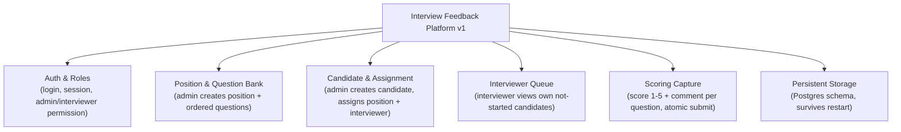
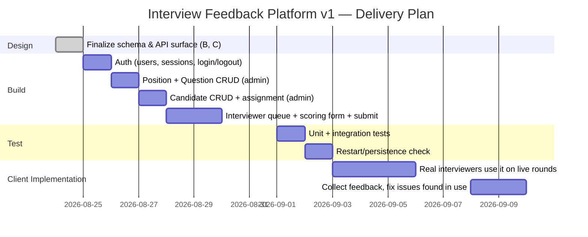
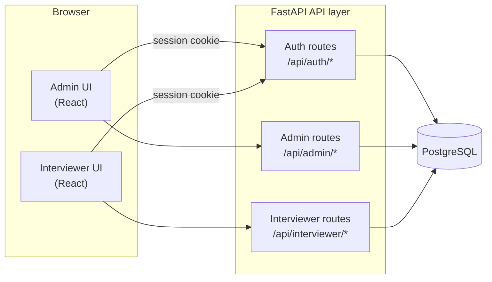
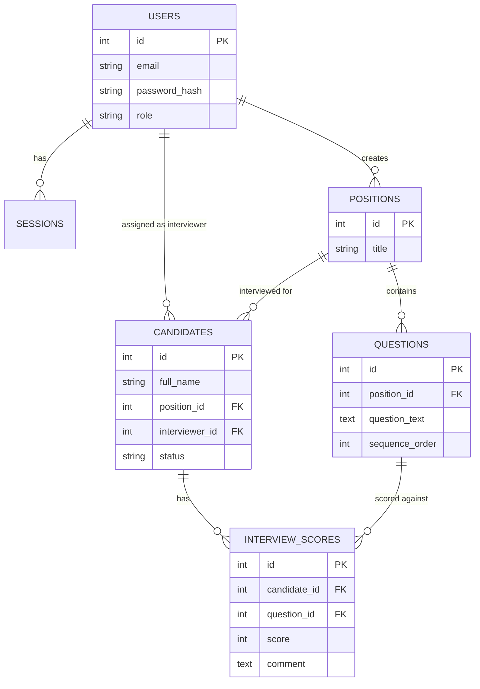

# IA Documentation — Interview Feedback Platform (v1)

Built with `/ia-problem-specification`, `/ia-planning`, `/ia-system-overview`.
Covers the v1 scope only, matching `docs/spec-v1-mvp.md`: admin login,
interviewer login, interviewer sees an assigned candidate's question set,
scores 1–5 + comment per question verbally, submits.

**Client note:** student is their own client (self-declared). An adviser
must still review and validate the success criteria below in writing before
this counts as validated — that sign-off is not something this doc can
generate for you.

Bracketed items like `[ORG NAME]` are placeholders only you can fill —
fabricating them would trip the "contrived client" failure mode the grading
guidance explicitly calls out.

---

## Criterion A — Problem Specification

### Description of Scenario

`[ORG NAME]` runs physical, in-person interviews for open roles, each
conducted verbally by one assigned interviewer against a fixed set of
role-specific questions. Today, feedback from these interviews is recorded
in a single shared spreadsheet that every interviewer edits directly after
their session. This causes three concrete, observed problems:

1. **Overwrite risk.** Because interviewers edit the same sheet
   concurrently, one interviewer's entry can be partially or fully
   overwritten by another's, with no record that a change happened.
2. **No enforced structure.** Scores are typed as free text into cells —
   there is no constraint stopping a "6", a blank, or a stray comment from
   ending up in a score column, so downstream review requires manually
   checking every entry for validity.
3. **No per-question breakdown.** The sheet records an overall impression
   per candidate rather than a score against each individual question, so
   it's not possible to see which specific competency a candidate was weak
   or strong on without asking the interviewer to recall it after the fact.

Interviewers access the sheet from their own laptops or phones over the
office Wi-Fi — there is no dedicated interview hardware and no intranet
system beyond that shared file.

### Rationale for Proposed Solution

A client-server web application backed by a relational database directly
addresses each of the three problems above, in a way that a spreadsheet
structurally cannot:

- **Overwrite risk → per-request database writes.** Each interviewer submits
  their own candidate's scores as a single write, scoped to that
  interviewer and that candidate (`interviewer_id` on the candidate record).
  There is no shared cell for two people to collide on.
- **No enforced structure → database constraints.** A `CHECK (score BETWEEN
  1 AND 5)` constraint on the `interview_scores` table makes an invalid
  score physically impossible to store, rather than relying on interviewers
  to type correctly.
- **No per-question breakdown → one row per (candidate, question).** The
  data model stores a score and comment against each individual question,
  so a per-competency view is a query away instead of a memory-dependent
  follow-up conversation.

Before settling on this approach, three checks were run:

- **Hardware/software compatibility:** interviewers already use their own
  laptops/phones on office Wi-Fi to access the current spreadsheet. A
  browser-based web app requires no new hardware and no installed software
  beyond a modern browser, which they already have.
- **Data availability:** all data the system needs (position titles,
  question text, candidate names, scores) is entered directly by the admin
  or interviewer at time of use — nothing depends on an external or
  third-party data source, so there is no availability risk.
- **Security implications:** the app is deployed on the local office network
  only, not exposed to the public internet; passwords are hashed, not
  stored in plaintext; sessions expire; and interviewers can only ever see
  candidates assigned to them, not the full candidate list or other
  interviewers' scores. This is a smaller attack surface than a shared
  spreadsheet link, which — once shared — cannot restrict who sees what.

A spreadsheet was considered and rejected specifically because none of the
three problems above are fixable within a spreadsheet without external
tooling (e.g. Apps Script validation, manual locking) that would end up
rebuilding, badly, what a real application does natively.

### Success Criteria

- An interviewer can log in with email + password and see only the
  candidates assigned to them, filtered to those not yet completed.
- An admin can create a Position and add an ordered list of at least one
  question to it.
- An admin can create a Candidate record assigned to exactly one Position
  and one Interviewer.
- An interviewer can open an assigned candidate and see that Position's
  questions in the exact order the admin entered them.
- An interviewer can enter a score from 1–5 and an optional text comment for
  every question in the list; the system rejects any score outside 1–5.
- Submitting saves all of that candidate's scores and flips their status to
  "completed" as a single all-or-nothing operation — no partial saves if
  interrupted.
- A completed candidate no longer appears in the interviewer's active queue.
- All entered data is still present and correct after the server is
  restarted (not held only in memory).

### Computational Context

**Client-server web application, relational-database backed** (FastAPI +
PostgreSQL + React), reachable only on the local office network.

This fits the scenario for two reasons that follow directly from the
rationale above: the data is inherently relational (a position *has*
questions, a candidate *has* scores against specific questions, each score
belongs to exactly one question and one candidate) so a relational database
with foreign keys and constraints is a natural fit, not an arbitrary choice;
and the office-only, browser-accessed usage pattern the client already has
(own laptops/phones, office Wi-Fi, no dedicated hardware) is satisfied
exactly by a locally-networked client-server app, with no need for
internet-facing infrastructure or native device software.

---

## Criterion B — Planning

### Decomposition



Each of these six components is essential — removing any one leaves a real
gap (e.g. without G, nothing survives a restart; without F, the whole point
of the tool is unmet) — and each maps directly to a schedulable, designable
unit below.

### Plan



**Success criteria → plan item mapping**

| Success criterion | Plan item |
|---|---|
| Interviewer login + filtered queue | Auth (dev1) + Interviewer queue (dev4) |
| Admin creates Position + ordered questions | Position + Question CRUD (dev2) |
| Admin creates Candidate, assigns Position + Interviewer | Candidate CRUD (dev3) |
| Interviewer sees questions in order | Interviewer queue + scoring form (dev4) |
| Score 1–5 + comment, invalid rejected | Scoring form (dev4) + unit tests (test1) |
| Atomic submit → completed | Scoring form (dev4) + integration tests (test1) |
| Completed candidate leaves active queue | Interviewer queue (dev4) + integration tests (test1) |
| Data survives restart | Persistence check (test2) |

**Client implementation window is explicitly scheduled** (imp1–imp2), not
left as an afterthought — this is the stage examiner reports flag as most
often missing or cut short.

### Relevant Research

- **FastAPI** — Python web framework for the API layer.
- **SQLAlchemy + Alembic** — ORM and versioned schema migrations.
- **passlib (bcrypt)** — password hashing, not custom-rolled.
- **React** — interviewer/admin frontend (candidate to swap for
  server-rendered templates if React adds more setup overhead than value at
  this scale — worth a quick spike before committing).

### Record of Tasks

Use the **official Record of Tasks template from `forms.zip`** — do not
substitute the table below for it. The list here is source content to
transcribe into that template as dated entries, updated as work actually
happens (not written up retroactively as one batch):

- Finalized v1 scope and data model (schema in `spec-v1-mvp.md`)
- Built auth (users, sessions, login/logout)
- Built Position + Question CRUD (admin)
- Built Candidate CRUD + assignment (admin)
- Built interviewer queue + scoring form + submit
- Ran unit + integration tests; logged any failures and fixes
- Verified data survives a server restart
- **Deployed for real interviewers to use on live interview rounds**
- Collected feedback from interviewers who used it; logged issues raised
- Fixed issues found during real use; confirmed with client (self) that
  success criteria are met in practice

Any issue that comes up during build or real use (a bug found in testing, a
piece of feedback from an interviewer, a scope change) belongs in this log
as it happens — not summarized after the fact.

---

## Criterion C — System Overview

### System Model

**Components and connections:**



**Data model:**



**Rules governing interaction:**

- Every `/api/admin/*` and `/api/interviewer/*` route requires a valid,
  unexpired session; no route is reachable unauthenticated.
- Every interviewer route filters by `interviewer_id = current session
  user` — an interviewer's query can only ever return their own assigned
  candidates, enforced at the query level, not just hidden in the UI.
- `questions.sequence_order` is unique per `position_id` — two questions on
  the same position can't claim the same order slot.
- `interview_scores.score` is constrained to 1–5 at the database level, not
  just validated in the UI.
- Submitting a candidate's scores and updating their status happens inside
  one database transaction — either all scores are written and the status
  flips, or none of it is, matching the "no partial saves" success
  criterion.

**UI wireframes (draft-stage, pre-build):**

```
Login                       Admin — Position + Questions
+----------------------+    +----------------------------------+
|  Interview Platform   |    | Position: [Backend Engineer    ] |
|  Email    [________]  |    | Questions (ordered):              |
|  Password [________]  |    |  1. Explain a rate limiter...  [x]|
|  [ Log in ]            |    |  2. A bug you fixed under...   [x]|
+----------------------+    |  [ + Add question ]               |
                             +----------------------------------+

Interviewer — Queue                Interviewer — Score Candidate
+----------------------------+     +--------------------------------+
| My Candidates (Not Started)|     | Jane Doe — Backend Engineer      |
|  - Jane Doe    [Open]      |     | Q1: Explain a rate limiter...    |
|  - Sam Lee     [Open]      |     |   Score [1-5: __]  Comment [___] |
+----------------------------+     | Q2: A bug you fixed under...     |
                                    |   Score [1-5: __]  Comment [___] |
                                    | [ Submit ]                       |
                                    +--------------------------------+
```

### Algorithms

**Login**
```
function login(email, password):
    user = query users where email = email
    if user is None: return 401
    if not verify_hash(password, user.password_hash): return 401
    session = create_session(user.id, expires_at = now + 8h)
    set_cookie(session.id)
    return 200
```

**Session validation (applied to every admin/interviewer route)**
```
function require_session(role_required):
    session = get_session_from_cookie()
    if session is None or session.expires_at < now: return 401
    user = query users where id = session.user_id
    if user.role != role_required: return 403
    return user
```
This is chosen over re-checking credentials per request because it avoids
re-hashing a password on every call — a deliberate trade of a small session
table for per-request performance, justified given interviewers will make
many requests per interview session.

**Add Question (admin)**
```
function add_question(position_id, question_text):
    require_session("admin")
    next_order = (max(sequence_order) for position_id) + 1, default 1
    insert into questions (position_id, question_text, next_order)
    return 201
```

**Assign Candidate (admin)**
```
function create_candidate(full_name, position_id, interviewer_id):
    require_session("admin")
    verify position_id exists and interviewer_id refers to a user with role "interviewer"
    insert into candidates (..., status = "not_started")
    return 201
```

**Get Interviewer Queue**
```
function get_queue():
    user = require_session("interviewer")
    return candidates where interviewer_id = user.id and status = "not_started"
```

**Submit Scores (atomic)**
```
function submit_scores(candidate_id, [ (question_id, score, comment) ]):
    user = require_session("interviewer")
    candidate = query candidates where id = candidate_id and interviewer_id = user.id
    if candidate is None: return 403
    expected_questions = questions where position_id = candidate.position_id
    if set(submitted question_ids) != set(expected_questions ids): return 400
    if any score not in 1..5: return 400

    begin transaction
        for each (question_id, score, comment):
            insert into interview_scores (candidate_id, question_id, score, comment)
        update candidates set status = "completed" where id = candidate_id
    commit transaction
    return 200
```
The all-or-nothing shape here (full validation before any write, one
transaction for all inserts + the status update) is what makes the "no
partial saves" success criterion actually true rather than merely likely —
a simpler per-question save-as-you-go approach was rejected because it
would let an interrupted submission leave a candidate half-scored with no
clear status.

### Testing Strategy

| Test ID | Description | Test Data | Expected Outcome | Success Criterion Verified |
|---|---|---|---|---|
| T1 | Login, valid credentials | Correct email + password | 200, session cookie set | Interviewer login + filtered queue |
| T2 | Login, wrong password | Correct email, wrong password | 401, no session set | Interviewer login + filtered queue |
| T3 | Login, unknown email | Email not in `users` | 401 (same generic error as T2, no user enumeration) | Interviewer login + filtered queue |
| T4 | Add question to position | Valid position_id, text | 201, `sequence_order` auto-incremented correctly | Admin creates Position + ordered questions |
| T5 | Two questions, same position | Add 2 questions in sequence | Orders assigned 1, 2 — no collision | Admin creates Position + ordered questions |
| T6 | Create candidate | Valid position_id + interviewer_id | 201, status = "not_started" | Admin creates Candidate, assigns Position + Interviewer |
| T7 | Create candidate, invalid interviewer_id | interviewer_id belongs to an admin user | 400/403 rejected | Admin creates Candidate, assigns Position + Interviewer |
| T8 | Interviewer views assigned candidate's questions | Candidate with 3 ordered questions | Questions returned in exact `sequence_order` | Interviewer sees questions in order |
| T9 | Submit valid scores | All questions answered, scores 1–5 | 200, all rows in `interview_scores`, status → completed | Score 1–5 + comment, invalid rejected / Atomic submit |
| T10 | Submit score = 0 | One score = 0 | 400 rejected, nothing written (CHECK constraint) | Score 1–5 + comment, invalid rejected |
| T11 | Submit score = 6 | One score = 6 | 400 rejected, nothing written | Score 1–5 + comment, invalid rejected |
| T12 | Submit missing one question's score | 2 of 3 questions answered | 400 rejected, no rows written for any question | Atomic submit → completed |
| T13 | Queue after completion | Candidate just marked completed | No longer returned by queue query | Completed candidate leaves active queue |
| T14 | Cross-interviewer isolation | Interviewer B requests interviewer A's candidate | 403/empty — not returned | Interviewer login + filtered queue |
| T15 | Restart persistence | Submit scores, restart server process, re-query | Same scores/status returned, unchanged | Data survives restart |

All eight success criteria from Criterion A have at least one covering
test above (T1–T3 → criterion 1, T4–T5 → criterion 2, T6–T7 → criterion 3,
T8 → criterion 4, T9–T11 → criterion 5, T9/T12 → criterion 6, T13 →
criterion 7, T15 → criterion 8), and invalid/edge-case input (T2, T3, T7,
T10, T11, T12) is covered alongside the valid path, not just the happy
path.
